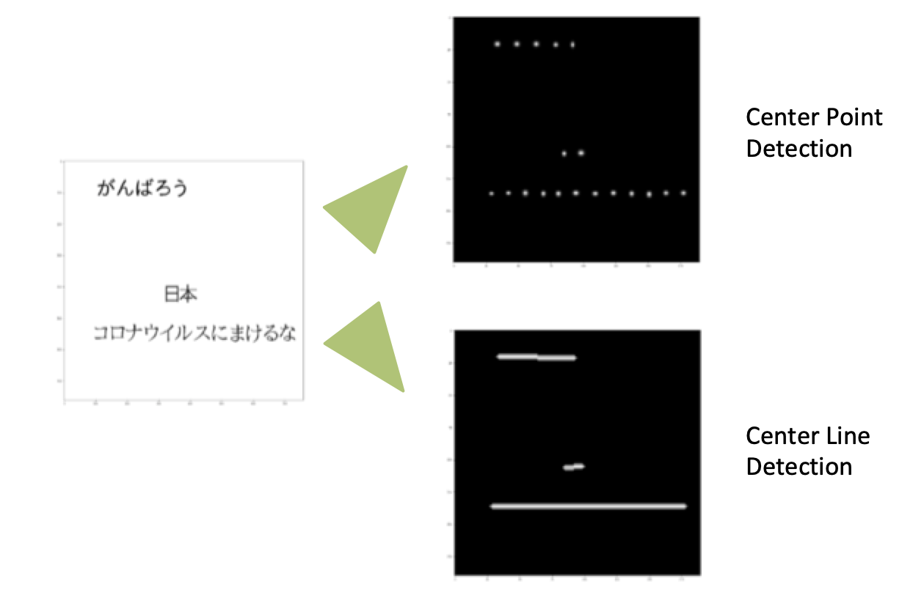
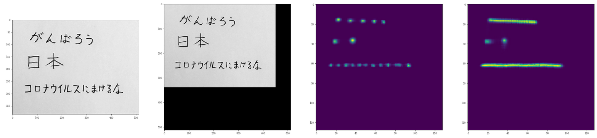
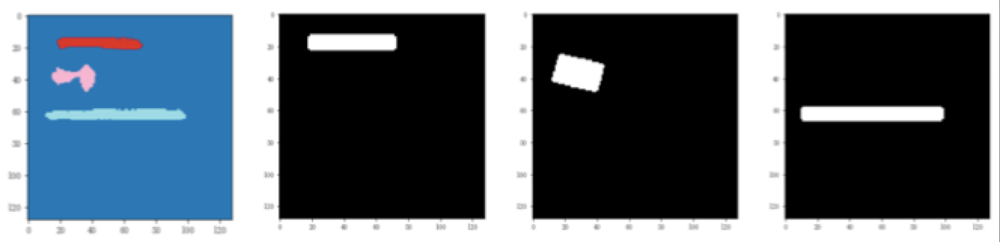
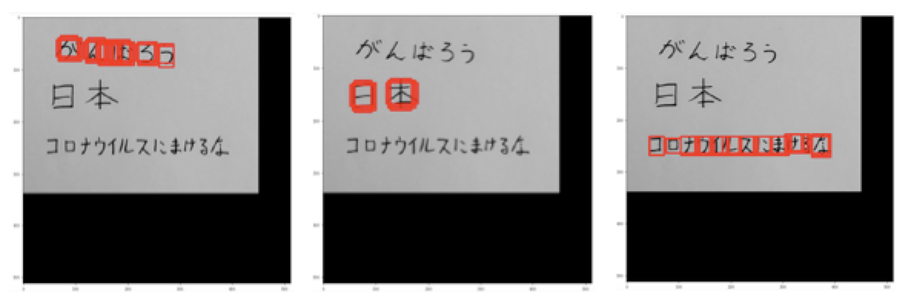
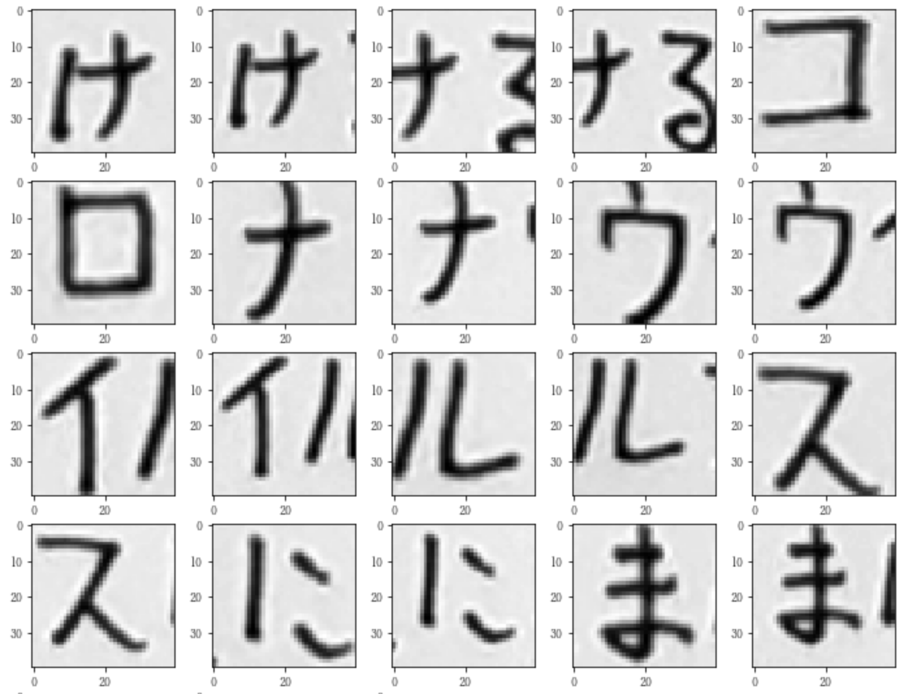
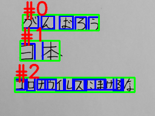

# 日本語OCR


## 日本語OCRです。

OCRそのものです。画像を入力して、文字を認識するプログラムです。


### **GoogleVisionとかのOCR APIと何が違うの？**

- 無料です
- 改変自由です
- 商用利用可です
- というかMITライセンスです
- サーバー無しで動かせます

### **認識出来る文字の種類は？**

- ひらがな、カタカナ、常用漢字、幾つかの英数記号を認識します
- 白抜き文字にも対応します

### **動かせる環境は？**

- Python3
- 推奨環境：GPUメモリ≧6GB、Linux OS、Pytorch、OpenCV-Python

### **モデルの学習は？**

- 今のところ、学習に使ったデータと学習用プログラムは公開していません
- 是非にと言う場合、個別に相談してくれれば、仕事として対応します


# 使い方 


## 手順


1. 学習済みのモデルをダウンロード

2. プログラムを実行

   

### **ダウンロード**


```sh
$ git clone https://github.com/tanreinama/OCR_Japanease.git
```


### **学習済みモデルをダウンロード**


```sh
$ cd OCR_Japanease
$ ./download_models.sh
```


### **OCRを実行**

ocr_japanease.pyがメインプログラムです。ファイル名（複数可）またはディレクトリ名（複数可）を指定します。ディレクトリ名を指定する場合、その中には画像ファイルのみが含まれていなければなりません。


```sh
$ python3 ocr_japanease.py testshot1.png
file "testshot1.png" detected in 72 dpi
[Block #0]
がんばろう
[Block #1]
日本
[Block #2]
コロナウイルスにまけるな
```


# 実行オプション


## DPIを指定する


適切なDPIの指定は**とても重要**です。画像の解像度とDPIが適切になっていないと、大体動きません。

DPIの指定は```--dpi```オプションで指定します。


```sh
$ python3 ocr_japanease.py --dpi 72 testshot1.png
```


```--dpi```オプションのデフォルト値は```-1```です。DPIに負の値を指定すると、出来るだけ良いDPIを見つけようと頑張ります。


## モデルファイルの指定


モデルファイルの指定は```--model```オプションで指定します。


```sh
$ python3 ocr_japanease.py --model font testshot2.png
```


モデルファイルは、```models```ディレクトリ内に保存されたファイルを読み込みます。[こちら](https://github.com/tanreinama/OCR_Japanease-models)には、```default```、```font```、```write```の三種類の学習済みモデルがあります。

それぞれ、

```default```　標準的なモデル

```font```　フォントデータからDAして作成したデータのみで学習させたモデル

```write```　手書き文字のみで学習させたモデル

となっています。


## GPU無しで実行する


```--cpu```オプションを指定して実行すると、GPU無し（CPUのみ）で動きます。遅いです。


```sh
$ python3 ocr_japanease.py --cpu testshot1.png
```


## JSONで出力する


```--output_format```オプションで、出力フォーマットを指定することが出来ます。指定出来るオプションは、```row```か```json```で、```json```を指定すると、詳細な認識結果（認識した場所やスコアなど）を含んだデータが出力されます。


```sh
$ python3 ocr_japanease.py --output_format json testshot1.png
```


## BoundingBoxを出力する


```--output_detect_img```オプションを指定すると、認識の結果の位置を四角で囲った画像が同時に出力されます。```--output_format```オプションで```json```を指定した場合の情報と同じ情報ですが、可視化しやすいのでデータのチェックに向いています。


```sh
$ python3 ocr_japanease.py --output_detect_img testshot1.png
```


画像は、入力画像に「-detections.png」という接尾詞を付けた名前で保存されます。


# 上手く動かないときは


## 1. DPIを変えて試す


適切なDPIの指定は**とても重要**です。入力画像がキレイなのにも拘わらず動かないときは、大抵DPIの指定が間違っています。

```--dpi```オプションのデフォルト値（-1で自動検出）は当てにしないでください。概ね、最も小さな文字が0.5cm相当の大きさになるサイズを目安にしてください。

画像の解像度とDPIが適切になっていないと、大体動きません。


## 2. 画像の解像度を変えて試す


デジタルカメラからの画像をそのまま、だと、大抵の場合解像度が高すぎます。よく解らないときは、最も小さな文字が15ピクセル四方程度になるサイズにリサイズして、全体が512ピクセル以下になるように切り出し、72dpiで実行します。


## 3. 画像の明度・コントラストの調整・ノイズリダクション


[こちら](https://github.com/tanreinama/OCR_Japanease-models)にある学習済みのモデルは、画像の明度やノイズなどに対しては割と耐性があります。しかし、適切なコントラストになるように事前に処理を行い、ノイズを消しておけば、その方が望ましいことは当然です。

ちなみに、ocr_japanease.pyによるOCRプログラムには、明度・コントラストの調整やノイズリダクションと言った画像の前処理は、**一切含まれていません**。

また、OCRの処理は、画像を**モノクロ画像に変換してから行います**。そのため、同じ程度の明度による、赤の背景に緑の文字、のような、モノクロにすると潰れて見えなくなってしまう文字は認識出来ません。


# 解説


## 使用するニューラルネットワーク


このOCRプログラムのメイン、基本的にはディープラーニングによって作成されたニューラルネットワークの実行です。

OCRに必要となるのは、文章領域・文字の検出用と、文字のクラス分類用の二つのニューラルネットワークです。


## Center Line Detection


まず、OCRでは、画像中にある文字を全て取り出せば、それで良いわけではありません。

文字は繋がって文章となり、ひとまとまりの文章として認識することで初めて意味のある結果になります。

このOCRプログラムでは、文章領域の抽出と、文字の抽出を、一つのニューラルネットワークで行っているのが特徴です。

ここで何をやっているかを知るには、[CenterNet](https://arxiv.org/abs/1808.01244)についての知識があると望ましいでしょう。CenterNetでは、物体検出に際して、BoundingBoxではなく中心点（からのガウス分布）をターゲットに学習させます。

この、中心点の検出は、文字単体についてはとてもよく動くのですが、文章領域の抽出には不向きです。

しかし、文章は、文字が縦または横に繋がっているため、文字の配置には制約が存在しています。

そこで導入したのは、文章を、文字の中心線を繋げた線として認識するソリューションです。





私はこの手法を「Center Line Detection」と呼んでいます。CenterNetの発想と同じく、中心線とそこからのガウス分布を学習させます。一度のニューラルネットワークの実行で、文字一つ一つの位置であるCenter PointとCenter Lineが同時に得られます。


## 文章領域の抽出


Center Line Detectionが出来れば、次はそれを文章領域にします。

下は左から、入力画像と、適切なDPIになるよう解像度を調整したもの（ニューラルネットワークへの入力）、Center Pointの認識結果、Center Lineの認識結果です。

Center Line Detectionによって文字の繋がりが見えていることが解ります。





そして、認識したCenter Lineを、OPTICSアルゴリズムによってクラスタリングします。

下は、クラスタリングの結果（一番左）と、その領域を内接矩形で囲ったものになります。

これで、画像中のどこが文章領域であるかが認識出来ました。





## BoundingBoxの作成


後は、Center Pointの認識結果から、それぞれのクラスターに含まれている点（CenterNetに習って周囲8ピクセルより高い値の点を抽出しています）を元にBoundingBoxを作成します。





## 文字のクラス分類


抽出されたBoundingBoxは、まだ文字の候補領域でしかありません。

この段階では、以下のように、重複して認識されたものが沢山あります。





これをクラス分類用のニューラルネットワークに全て入力し、認識結果を得ます。

そして、認識結果から、文字として認識したものの内から、その確率を得ます（出力層のsoftmaxの値）。

最も文字として認識された確率と、Center Pointの認識結果から得られる、そこに文字がある確率とを掛け合わせると、BoundingBoxの確率スコアになります。


## NMSを実行


そして、BoundingBoxの確率スコアに基づくNonMaxSuppressionを実行すると、OCRの結果が得られます。





後は、小さな「っ」の認識だとか、カタカナのカと漢字の力のような、同じ形をした文字を、前後の文字種類から推測してやる処理が行われ、最終的な結果が作成されます。


# Reference


https://github.com/tanreinama/OCR_Japanease-models


