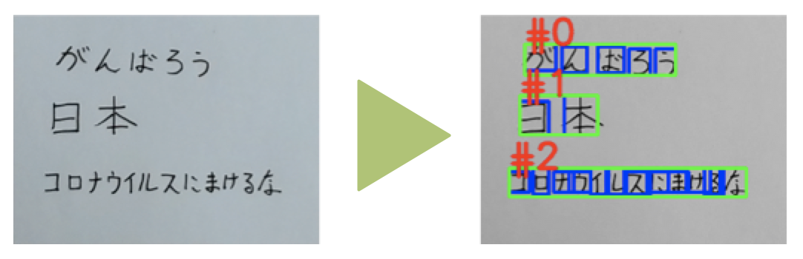

# 日本語OCR


## 日本語OCRです。

OCRそのものです。画像を入力して、文字を認識するプログラムです。

このプロジェクトは、[スポンサーを募集しています](report/sponsor.md)。





**NEW!**

- バージョン2リリース（2021/2/28）


### **GoogleVisionとかのOCR APIと何が違うの？**

- 無料です
- 改変自由です
- 商用利用可です
- というかMITライセンスです
- サーバー無しで動かせます

### **認識出来る文字の種類は？**

- ひらがな、カタカナ、常用漢字、幾つかの英数記号を認識します
- 白抜き文字にも対応します
- 縦書き・横書き、混在しても両対応します

### **動かせる環境は？**

- Python3
- Pytorch ≧ 1.2.0
- OpenCV-Python ≧ 4.1.0
- 推奨環境：GPUメモリ≧6GB、Pytorchが対応するバージョンのCUDA、Linux OS

### **モデルの学習は？**

- 公開されているモデルの学習側コードは公開していません（GitHubスポンサーのリターンに設定しています）

- [こちらの書籍](https://www.amazon.co.jp/dp/4863543530)で、横書きの文字列に特化したファインチューニングを行う方法を解説しています

- 実際の公開モデルは、書籍にある以外にも色々と性能向上の手法が取り入れられています

  


# 使い方


### **1.プログラムをダウンロード**


GitHubからクローンします。

```sh
$ git clone https://github.com/tanreinama/OCR_Japanease.git
$ cd OCR_Japanease
```


### **2.学習済みモデルをダウンロード**


[こちらのURL](https://nama.ne.jp/models/ocr_jp-v2.zip)からモデルをダウンロードして展開します（[予備URL](https://s3-ap-northeast-1.amazonaws.com/ailab.nama.ne.jp/models/ocr_jp-v2.zip)）。

```sh
$ wget https://nama.ne.jp/models/ocr_jp-v2.zip
$ unzip ocr_jp-v2.zip
```


### **3.OCRを実行**

ocr_japanease.pyがメインプログラムです。ファイル名（複数可）またはディレクトリ名（複数可）を指定します。ディレクトリ名を指定する場合、その中には画像ファイルのみが含まれていなければなりません。


```sh
$ python3 ocr_japanease.py testshot1.png
file "testshot1.png" detected in 72 dpi
[Block #0]
コロナウイルスにまけるな
[Block #1]
がんばろう
[Block #2]
日本
```


# 実行オプション


## DPIを指定する


適切なDPIの指定は**とても重要**です。画像の解像度とDPIが適切になっていないと、大体動きません。

DPIの指定は```--dpi```オプションで指定します。


```sh
$ python3 ocr_japanease.py --dpi 72 testshot1.png
```


```--dpi```オプションのデフォルト値は```-1```です。DPIに負の値を指定すると、出来るだけ良いDPIを見つけようと頑張ります。```0```を指定すると、入力画像そのままの解像度でOCRします（非推奨）。


## GPU無し、又は低スペックGPUで実行する


```--cpu```オプションを指定して実行すると、GPU無し（CPUのみ）で動きます。遅いです。


```sh
$ python3 ocr_japanease.py --cpu testshot1.png
```


```--low_gpu_memory```オプションを指定すると、少ないGPUメモリで動作するモードになります。


```sh
$ python3 ocr_japanease.py --low_gpu_memory testshot1.png
```


## JSONで出力する


```--output_format```オプションで、出力フォーマットを指定することが出来ます。指定出来るオプションは、```row```か```json```で、```json```を指定すると、詳細な認識結果（認識した場所やスコアなど）を含んだデータが出力されます。


```sh
$ python3 ocr_japanease.py --output_format json testshot1.png
```


## BoundingBoxを出力する


```--output_detect_img```オプションを指定すると、認識の結果の位置を四角で囲った画像が同時に出力されます。```--output_format```オプションで```json```を指定した場合の情報と同じ情報ですが、可視化しやすいのでデータのチェックに向いています。


```sh
$ python3 ocr_japanease.py --output_detect_img testshot1.png
```


画像は、入力画像に「-detections.png」という接尾詞を付けた名前で保存されます。


# 上手く動かないときは


## 1. DPIを変えて試す


適切なDPIの指定は**とても重要**です。入力画像がキレイなのにも拘わらず動かないときは、大抵DPIの指定が間違っています。

```--dpi```オプションのデフォルト値（-1で自動検出）は当てにしないでください。概ね、最も小さな文字が0.5cm相当の大きさになるサイズを目安にしてください。

画像の解像度とDPIが適切になっていないと、大体動きません。


## 2. 画像の解像度を変えて試す


デジタルカメラからの画像をそのまま、だと、大抵の場合解像度が高すぎます。よく解らないときは、最も小さな文字が15ピクセル四方程度になるサイズにリサイズして、全体が512ピクセル以下になるように切り出し、72dpiで実行します。また、大きすぎる文字は逆に認識しにくくなります。認識精度が低いと感じたときは、少し小さめに画像をリサイズすると上手くゆくことがあります。


## 3. 画像の明度・コントラストの調整・ノイズリダクション


[こちら](https://nama.ne.jp/models/ocr_jp-v2.zip)にある学習済みのモデルは、画像の明度やノイズなどに対しては割と耐性があります。しかし、適切なコントラストになるように事前に処理を行い、ノイズを消しておけば、その方が望ましいことは当然です。

ちなみに、ocr_japanease.pyによるOCRプログラムには、明度・コントラストの調整やノイズリダクションと言った画像の前処理は、**一切含まれていません**。

また、OCRの処理は、画像を**モノクロ画像に変換してから行います**。そのため、同じ程度の明度による、赤の背景に緑の文字、のような、モノクロにすると潰れて見えなくなってしまう文字は認識出来ません。


# 解説


[解説](report/technology.md)

[モデルのファインチューニングについて書いてある書籍](https://www.amazon.co.jp/dp/4863543530)

