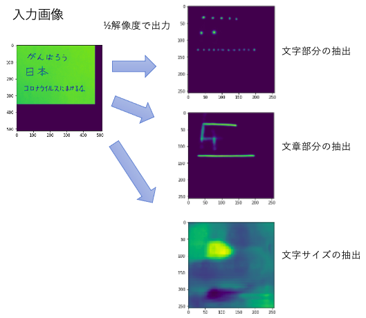
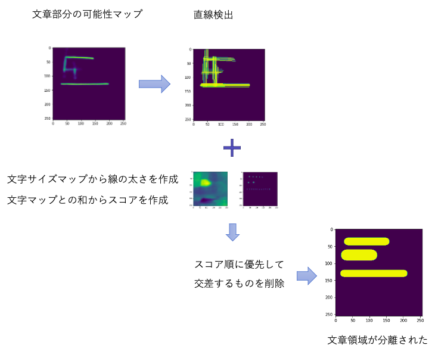
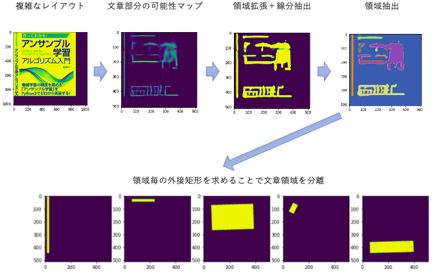
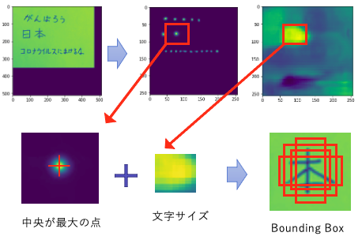
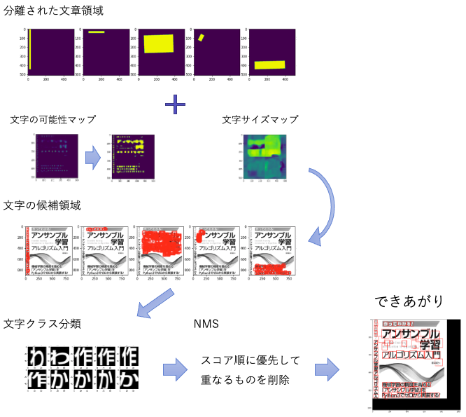

# 日本語OCR解説

技術解説

# DetectionNet

このOCRプログラムは、OCRプログラムの作成に必要な「文章領域の分離」と「文字種の分類」を、2回のニューラルネットワーク実行で実行します。

2つのニューラルネットワークは共に、モデルサイズが100MB以下で、バッチサイズ4と64の場合にGPU消費メモリが6GB以下になるように設計されました。

一つ目のニューラルネットワークの実行はDetectionNetで、OCRプログラム中では「DetectionNet」クラスで定義されています。

## ニューラルネットワークの入力と出力

DetectionNetはResNetブロックによるU-Netの拡張で、512×512ピクセル×1チャンネルの画像を入力し、256×256ピクセル×4チャンネルの画像を出力します。

このニューラルネットワークは、バッチサイズ4（--low_gpu_memory時は1）で実行されます。

出力画像のチャンネルには、それぞれ、画像中の対応する位置が、文字である確率、文である確率、文字の大きさ（幅と高さ）が割り当てられています。

# Sentence Separation

ここでの「文」は、ひと繋がりの文字からなる、1行の文字列を指します。

DetectionNetが出力した文である可能性の出力マップ画像から、画像処理によて文章領域の分離を行います。

「文章領域」とは、複数の文を含んでいるかもしれないひとまとまりの文章エリアで、OCRプログラム中では「SentenceBox」クラスでデータ構造が定義されます。

## Center Line Detection

まず、シンプルな構造の画像については、文が文章領域そのものになっていると仮定し、全ての文を分離します。

それには、文である可能性マップの出力を画像処理の直線検出にかけて、全ての線分をCenter Lineとして抽出します。

Center Lineとは、文である可能性のある線分の候補です。OCRプログラム中では「CenterLine」クラスでデータ構造が定義されます。

### 交差する線分の削除

Center Lineには、その線分が実際に文である可能性を表すスコアが付けられます。

スコアは、文字サイズの出力から線分の幅を作成し、その範囲内における、文字である確率マップから閾値＞0.015以上のピクセルの数をカウントします。

そして、スコア順に優先して近接あるいは交差する線分を削除してゆくと、文の位置が抽出されます。

## 複雑なレイアウトにおける処理

より複雑なイメージにおいては、複数の文からなる文章領域が登場するので、もう少し複雑な処理を行います。

シンプルな文の抽出で抽出された文の数が閾値＞5の場合、クラスタリングによる領域抽出を行います。

### クラスタリングによる領域抽出

クラスタリングによる領域抽出では、まず、文である可能性の出力マップを、画像処理の線分抽出と領域拡張を使って適切なコントラストの画像にし、閾値＞0.01によって二値化します。

そして、クラスタリングアルゴリズムによって領域抽出を行い、文章領域を分離します。

### 外接矩形の取得と重複の削除

分離された文章領域はさらに、画像処理によって外接矩形とされます。そして、重複する部分を削除して、最終的な文章領域をされます。

# Classification & NMS

二つ目のニューラルネットワークの実行は、ClassificationNetでで、OCRプログラム中では「CharactorNet」クラスで定義されています。

CharactorNetはMobileNetV1の拡張で、56×56ピクセル1チャンネルの入力画像を、ひらがな＋カタカナ＋常用漢字＋英数記号からなる文字へとクラス分類する画像認識ニューラルネットワークです。

このニューラルネットワークは、バッチサイズ64（--low_gpu_memory時は16）で実行されます。

## Make Bounding Boxs

文字領域の候補はBounding Boxとして定義され、OCRプログラム中では「BoundingBox」にデータ構造が実装されます。

全ての文章領域中から、3×3ピクセルの中で真ん中が最も大きな値を取る位置を選択し、その周辺にBounding Boxを作成します。この処理は[CenterNet](https://arxiv.org/abs/1808.01244)による物体検出の流用です。

Bounding Boxは最終的な文字領域ではなく、あくまで候補領域なので、文字サイズの出力マップを元に、複数の異なるサイズを作成します。

## Classification

Bounding Boxが作成されたら、全てのBounding Boxについて、その中にある画像を取りだして、ClassificationNetを実行します。

バッチ処理を最適化するために、全ての文章領域に含まれるBounding Boxを一度に処理します。そのために、Bounding Boxには所属する文章領域の情報が含まれています。

ClassificationNetを実行すると、認識された文字と、その文字の確率スコアが得られます。

そこで、DetectionNetの文字である確率マップの出力値と、ClassificationNetの確率スコアを掛け合わせて、Bounding Boxのスコアとします。

## Non Max Suppression

その後に、Bounding Boxのスコアを優先して、重複するBounding Boxを削除してゆきます。

閾値＞0.2の割合で面積が被っているBounding Boxは、スコアの大きい方を残して小さい方を削除します。

この処理は、「Non Max Suppression（NMS）」アルゴリズムと呼ばれます。

NMSを実行すると、最終的な文字の位置と、文字の種類が得られます。

## Post Process

最後に、小さな「っ」の認識だとか、カタカナのカと漢字の力のような、同じ形をした文字を、前後の文字種類から推測してやる後処理が行われ、最終的な結果が作成されます。

後処理は、辞書から、直前直後の文字種が一致する場合は置換を行います。

例えば小さな「っ」の認識は、かたかな＋常用漢字の後に登場する「つ」で、その後が「たちつてと」であれば「っ」に変換します。

